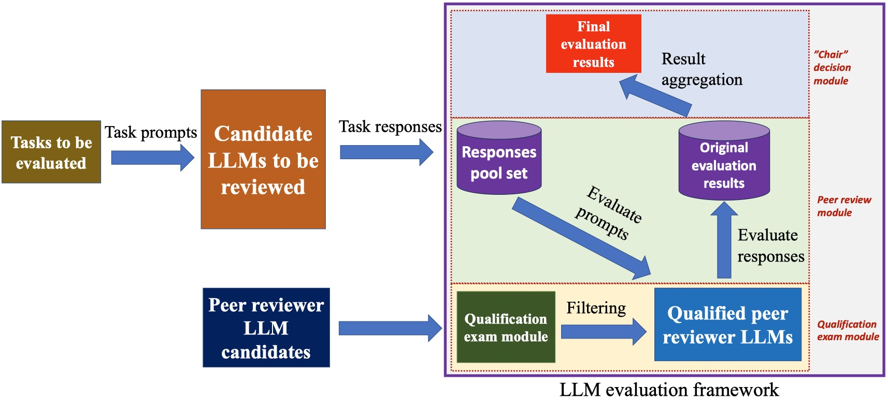

## PRE: Peer Review Evaluator
This is a general framework used on evaluating the performance of large language models (LLMs) based on the peer review mechanism among LLMs.

#### Get Started

**Install nessary package:**

```bash
pip install -r requirements.txt
```

**Run toy example:**

```bash
python main.py --config config/main.yaml
```

#### Framework

Following figure shows the framework of our evaluation framework. 



Our whole framework could be divided into three main modules

- **Qualification exam module**: Conduct qualification exam, to filter out in-qualified LLMs. You could modify [exam.yaml](https://github.com/chuzhumin98/PRE/blob/main/config/exam.yaml) to config the setting of this module. Some key config parameters:
  - source: *same* / *others*. *same* denotes the exam data comes from the samples of LLMs' task responses, while *others* denotes the exam data is collected from other tasks.
  - mode: *pointwise* / *pairwise*. Determine the exam task's format.
  - conduct_reference_exam: whether or not to conduct reference exam, i.e., compare the evaluator candidate LLM's responses with the ground truth (need to be provided by user)
  - conduct_inner_consistency_exam: whether or not to conduct inner-consistency exam, i.e., compare the candidate LLM's responses on the given prompt template with another new prompt template (need to be provided by user)
  - metric_pointwise: *EM* (exact match) / *MSE* (mean square error), the evaluation metric of the LLMs' exam performance on pointwise mode
- **Peer review module**: Collect the responses of all evaluatee LLMs to the given tasks. Then, each qualified reviewer LLM is required to rate the outputs in the response pool set. You could modify [evaluatees.yaml](https://github.com/chuzhumin98/PRE/blob/main/config/evaluatees.yaml) and [evaluators.yaml](https://github.com/chuzhumin98/PRE/blob/main/config/evaluators.yaml) to config the setting of the evaluatee LLMs and evaluator LLMs, also you could modify [data.yaml](https://github.com/chuzhumin98/PRE/blob/main/config/data.yaml) to config the setting of task data loader. It is worth noting that our LLM APIs support user-customed. You could inherit the abstract class [LLM_API](https://github.com/chuzhumin98/PRE/blob/main/PRE/api.py) to implement a custom interface. You just need to register this interface class in the API_type2class_list before using it.
- **“Chair” decision module**: Aggregate the ratings of evaluator LLMs and generate the final evaluation results. You could modify [eval.yaml](https://github.com/chuzhumin98/PRE/blob/main/config/eval.yaml) to config the setting of this module. Some key config parameters:
  - strategy: *full / ELO / Glicko*. *full* denote using the whole pointwise / pairwise set of evaluation tasks to generate the final results. While *ELO* and *Gilcko* are widely used in chess gaming, they only need to use some samples to obtain the final results.
  - mode: *pointwise* / *pairwise*. Determine the exam task's format.
  - weighted_method: *uniform / exp / log / poly*. The weights of each evaluator, which are computed based on the performance of LLMs in qualification exam.

There are several advantages of our framework:

- Supports Disconnected Connections: to tackle the potential unstable situations of the LLM APIs
- User code-free: user is able to run the project just after supplementing their own task data and configing the yaml config files, no need to modify the codes
- Customed-friendly: user could customize their special extension if they have some expansion usage requirement. Our framework is welcome for these personalized requirments
- Support mutli-processing: Our framework support multi-processing, user could run many APIs at the same time.


